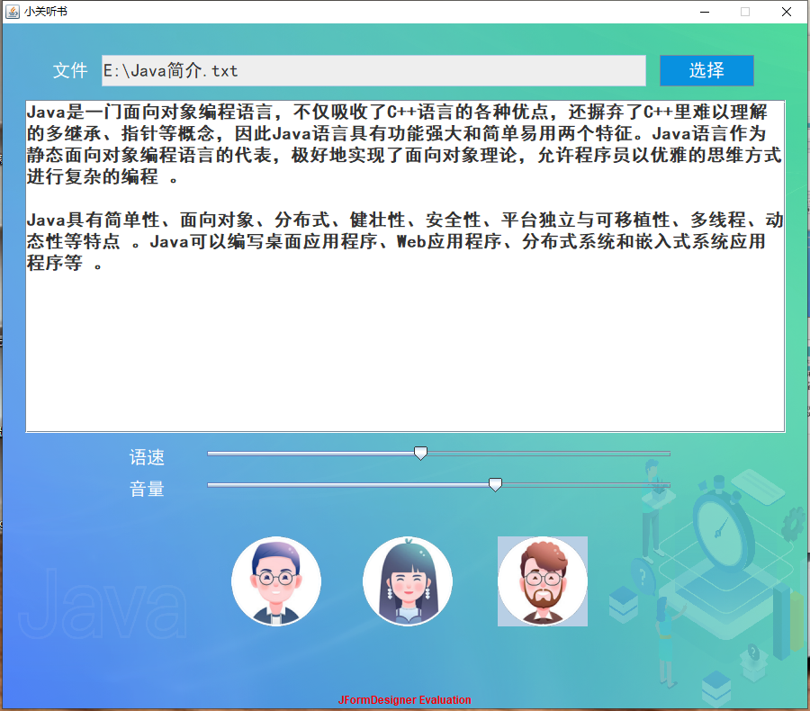

> 作者：Jia'nan Zhao  
> 开发时间：2021 年 6月  
> 所属课程：Java  
> 技术栈：Java   +  JDK 1.8   + IntelliJ IDEA Community 2020.3.3 + JForm Designer

# 📖 小关听书APP（本地版）



> 🧠 一个本地运行的文字转语音（TTS）听书工具，用 Java 实现，集成讯飞语音合成接口，支持文本朗读与本地TXT文件导入！

---

## 🌟 项目简介

**小关听书APP** 是基于 Java Swing 桌面应用框架，结合科大讯飞 TTS 接口开发的本地听书应用。它具备：

- 支持文本输入 & TXT文本导入朗读；
- 三种发音人选择（男声 / 女声 / 童声）；
- 可调语速和音量；
- 一键语音播放，轻松实现“边听边学”。

---

## 🛠️ 开发环境

| 工具         | 说明                              |
|--------------|-----------------------------------|
| 开发语言     | Java                              |
| JDK版本      | JDK 1.8                           |
| 编译器       | IntelliJ IDEA Community 2020.3.3 |
| UI插件       | JForm Designer                    |
| 操作系统     | Windows 10                        |

---

## 🧩 核心功能模块

```
flowchart TD
    A[输入文本] --> B[选择语音类型]
    B --> C[点击播放]
    C --> D[生成语音文件]
    D --> E[播放语音]
    A2[导入TXT文件] --> A
```

---

## 📥 使用方法

### ✅ 1. 输入或导入文本
- 可以直接粘贴文字至文本框；
- 也可以通过“选择”按钮导入本地 TXT 文件。

### ✅ 2. 选择朗读声音
- 支持：
  - 男声（aisjiuxu）
  - 女声（xiaoyan）
  - 童声（aisbabyxu）

### ✅ 3. 调整语速与音量
- 拖动滑块调节；
- 默认语速：40，默认音量：60。

### ✅ 4. 听书
- 点击对应人像按钮，TTS 处理并播放语音。

---

## 🚀 打包与发布

### 📦 打包为 `.jar` 文件
在 IntelliJ IDEA 中打包程序为 `guan_reader.jar`。

### 🔄 转换为 `.exe` 文件
使用工具：[exe4j](https://www.ej-technologies.com/products/exe4j/overview.html)

操作步骤：
1. 选择项目类型；
2. 设置图标、主类、JVM路径；
3. 完成后生成 `guan_reader.exe`，可直接双击运行！

> 📌 详细教程：  
> [如何将Java项目打包成exe文件](https://blog.csdn.net/Mumaren6/article/details/115265136)

---

## 🎬 软件界面预览

| 操作                     | 截图预览                    |
|--------------------------|-----------------------------|
| 软件启动界面             |  |
| 文本粘贴识别朗读         |  |
| 导入本地TXT并朗读        |  |

> 注：图片请根据项目实际路径替换为合适的本地或线上地址。

---

## 🔐 TTS 代码片段（核心逻辑）

```java
TTS tts = new TTS();
tts.appid = "你的appid";
tts.apiKey = "你的apikey";
tts.apiSecret = "你的apisecret";

String authUrl = tts.getAuthUrl();
String filePath = tts.startDoTTS(authUrl, "Hello World", "xiaoyan", 50, 70);
tts.play(filePath);
```

---

## 📚 参考资料

- Java2 实用教程，第5版，清华大学出版社
- Java语言在计算机软件开发中的应用，电子技术与软件工程
- [科大讯飞开放平台](https://www.xfyun.cn/services/online_tts)

---

## 📌 项目总结

本项目是我在 Java 课程设计中的实践成果，通过本地TTS技术实现简单、实用的听书功能。它不仅提升了我对 Java 面向对象编程、图形界面开发、API接入与软件打包的理解，也让我收获了完整软件开发流程的经验。

> 🙋‍♂️ 作者：Jia'nan Zhao
> 📅 完成时间：2021年6月  

---


